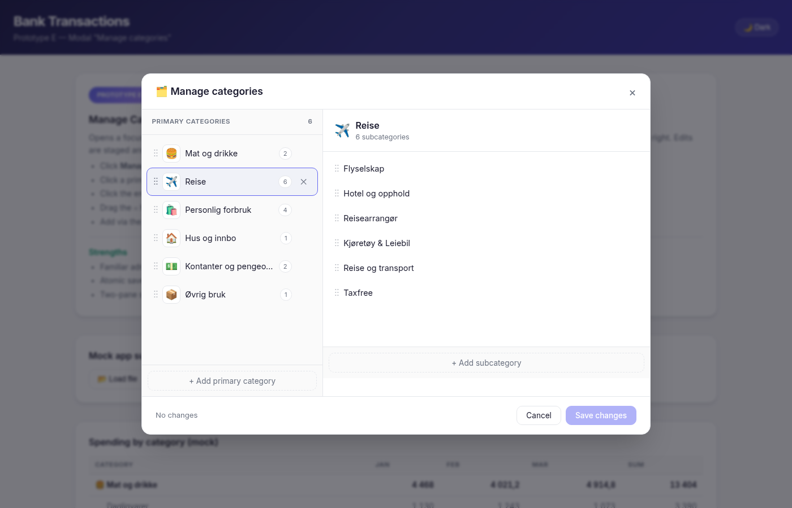
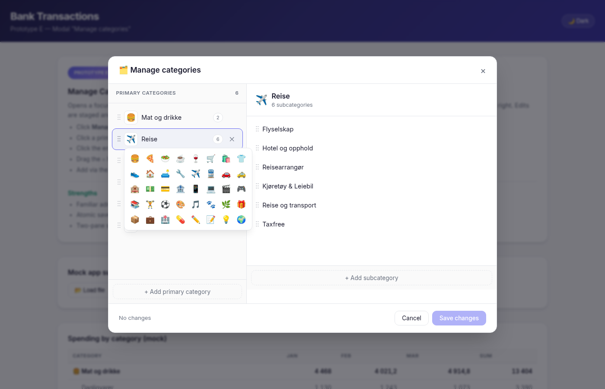
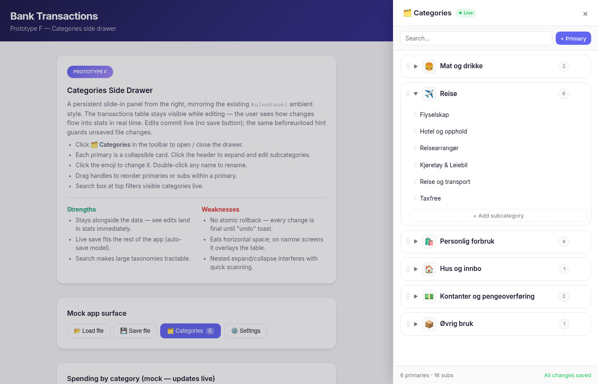
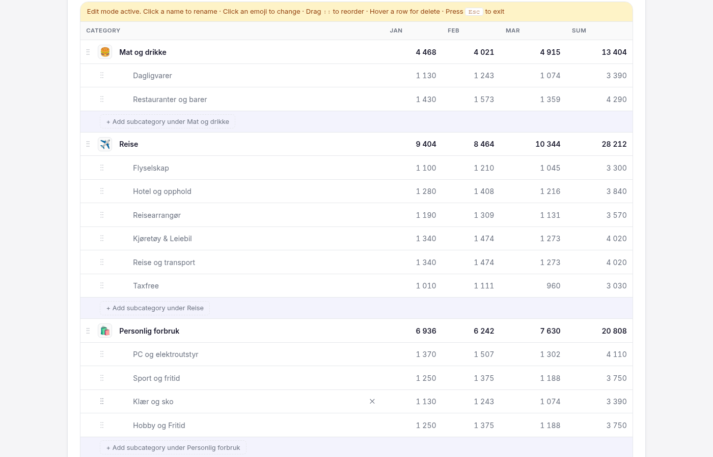
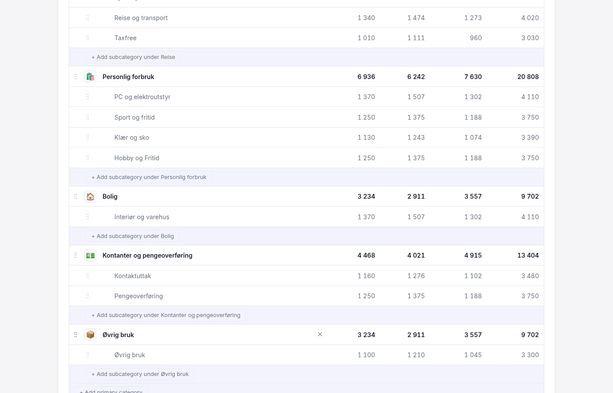

# Design: Editable Category Tree

## Problem

The category *tree* — the list of available primaries (e.g. "Mat og drikke") and
their subs (e.g. "Dagligvarer") — is fixed. Users can author *rules* that
re-route a transaction's text to a different category (`prototype-d-…`,
`DESIGN-prototype-d-rules.md`), but the categories those rules can target are
hard-coded: the dropdown derives them from `merchantCodeMappings`, which is
hydrated from the static `v2/frontend/src/data/categories.json`.

A user who wants to track spending differently — e.g. split "Mat og drikke" into
"Dagligvarer", "Restaurant", "Take-away", or rename "Øvrig bruk" to something
clearer — has no way to do it from the UI. The infrastructure already exists:
`SaveFile.categories: CategoryTree` is persisted, `ConfigContext` exposes
`updateCategories`, and the type carries an optional `emoji` field. Nothing
consumes it from the UI yet.

## Scope

Editing the category tree itself: adding, renaming, deleting, and reordering
primaries and subs, plus setting an emoji per primary. Out of scope:

- **Re-mapping merchant codes.** That edits `merchantCodeMappings`, not
  `categories`.
- **Per-transaction overrides.** Already covered by text-pattern rules.
- **Inline "create category from a transaction".** Possible follow-up; would
  bridge the rules dialog with the tree editor.

## Prototypes

Three standalone HTML/CSS/vanilla-JS prototypes were built to explore distinct
UX directions. All three reuse the existing prototype design tokens (light/dark
mode, fonts, radii) and demonstrate full create/rename/delete/reorder for
primaries and subs plus emoji selection on primaries.

### E: Manage-Categories Modal — `prototypes/prototype-e-manage-modal.html`

A "🗂️ Manage categories" button in the existing `ConfigToolbar` opens a
focused two-pane modal. Left pane: ordered list of primaries with emoji,
name, sub-count badge, drag handle, delete; "+ Add primary category" at the
bottom. Right pane: subs of the currently selected primary with drag/delete;
"+ Add subcategory" at the bottom. Edits are staged in `workingTree` and
committed via Save (or discarded via Cancel) — the underlying app state only
changes on Save.

**Strengths.** Familiar admin pattern. Atomic save → unconditional Cancel.
Two-pane layout scales as taxonomies grow without scroll-jumping.

**Weaknesses.** Hides the underlying transactions table. Adds a Save/Cancel
gate that feels heavy for tiny edits. Extra click to enter "edit mode".

### F: Categories Side Drawer — `prototypes/prototype-f-categories-drawer.html`

A right-side drawer that slides in from the existing toolbar button, mirroring
the ambient style of the existing `RulesPanel`. Each primary is a collapsible
card showing its sub-count badge; expanding reveals subs with drag/delete and
"+ Add subcategory". A search box at the top filters primaries and subs live.
Edits commit immediately (no Save button); destructive actions show a toast
with **Undo**. The transactions table remains visible alongside on wide
viewports.

**Strengths.** See the data react in real time as you edit. Matches the
auto-save model used elsewhere in the app. Search makes large taxonomies
tractable.

**Weaknesses.** No atomic rollback — only single-step undo via toast. Eats
horizontal real estate; on narrow viewports it overlays the table. Nested
expand/collapse interferes with quick scanning.

### G: Inline Edit-Mode in the Statistics Table — `prototypes/prototype-g-inline-edit-mode.html`

An "✏️ Edit categories" toggle pinned above the existing statistics table.
While on, every category row in the table itself becomes editable: drag handle
appears, emoji becomes a clickable picker, name becomes click-to-rename
(Enter commits, Esc cancels), hover reveals delete. "+ Add subcategory under
&lt;primary&gt;" rows appear after each primary's subs, plus a "+ Add primary
category" at the bottom. Toggle off → table returns to read-only.

**Strengths.** Direct manipulation: edit the thing you see. No new UI surface
or navigation. Categories with no transactions can still be edited because the
table renders their (zero-valued) rows in edit-mode.

**Weaknesses.** Editing chrome competes with data display — risk of clutter,
especially on narrow rows. Mobile viability is poor (small targets, drag
handles in tight rows). Edits are immediate; no bulk discard.

## Trade-offs at a glance

| Axis | E (Modal) | F (Drawer) | G (Inline) |
|---|---|---|---|
| Surface area | New modal | New drawer | None — table itself |
| Save model | Atomic (Save/Cancel) | Live with single-step undo | Live, no undo |
| Sees data while editing | No | Yes (wide viewports) | Yes |
| Entry cost | 1 click + modal | 1 click + drawer | 1 click toggle |
| Mobile-friendly | Yes (full-screen) | Partial (overlays) | No |
| Maps to existing pattern | New | Mirrors `RulesPanel` | Mirrors sortable headers |

## Recommendation

The choice depends on the underlying save model the app should commit to. If
the persistence model is **dirty-tracked-then-saved** (matches the existing
`SaveFile` import/export with `isDirty` warning on unload), then **E** lines
up best — the modal's atomic Save composes naturally with file-save semantics
and gives a clean rollback path that the live-save designs cannot match.

If the model is **always-live with auto-persist**, **F** is the closest fit —
it mirrors how rules already work in the app (`RulesPanel` with `Toast` undo
on destructive actions) and keeps editing alongside the data.

**G** is the most opinionated and should only be picked if the team is willing
to accept that mobile is a degraded experience for category editing. It is the
strongest choice for desktop power users.

A reasonable hybrid: ship **E** first for atomic editing matching the
SaveFile model, and keep **F** as a follow-up if user feedback shows that the
modal's "open → edit → save" loop is too heavy for incremental tweaks.

## Implementation notes (for whichever path is chosen)

- The model already exists: `CategoryTree` in `v2/shared/types.ts`,
  `updateCategories` in `ConfigContext`. Persistence rides on the existing
  `SaveFile` infrastructure (`#56`/`#59`).
- Renaming a primary or sub must update any `TextPatternRule.category` that
  references it. Either rewrite rules atomically with the rename, or block the
  rename if rules reference the old name and surface the conflict.
- Deleting a primary or sub must do the same: either cascade-delete dependent
  rules (with confirmation listing them) or block deletion. Either way, the
  category dropdown derived in `CategoryDropdown.tsx` must source its list
  from `config.categories` rather than `merchantCodeMappings`, otherwise
  deletions in the tree will not be reflected in the picker.
- The merchant-code lookup (`categories.json`) currently produces categories
  via `parseTransactions(merchantCodeMappings, …)`. After the tree becomes
  user-editable, those produced categories may not exist in the tree — decide
  whether to fall back to "Ukjent kategori" (current behaviour for unknown
  codes) or to upsert them into the tree on first sight.

## Status

- 2026-04-25 — three prototypes added (E/F/G). Earlier rule-editing prototypes
  A–D shipped as `feat: SaveFile persistence infrastructure` (#56) and
  `Improve category system with hierarchical categories` (#36). This document
  supersedes the original A/B/C exploration, which was actually about
  *rule* editing rather than tree editing.
